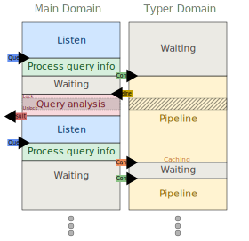

# merlin-mockup

A simplified mock-up of [merlin-domains](https://github.com/ocaml/merlin/tree/merlin-domains), used to experiment with multicore designs for Merlin.

## Purpose

[merlin-domains](https://github.com/ocaml/merlin/tree/merlin-domains) is an experimental branch of Merlin that uses two domains to improve performance. The mock-up reproduces the key concurrency patterns of merlin-domains in a smaller codebase, making it easier to prototype and evaluate design choices.

The three features explored are:

- **Early type return**: the typer domain shares a partial result with the main domain as soon as possible, so the main domain can start analysis without waiting for the full buffer to be typed.
- **Parallelization**: typing and analysis run concurrently on the partial result.
- **Cancellation**: if a new request arrives while the typer is still working, the main domain cancels the current work.

## Architecture

The mock-up uses two domains:

- **Main domain**: listens for requests, dispatches work, runs analysis, and responds.
- **Typer domain**: receives configurations through a message-passing structure (`Hermes`), runs a simplified typer (`Moparser`), and shares results back.

Key modules:

| Module | Role |
|--------|------|
| `merlin_mockup.ml` | Entry point, spawns both domains |
| `hermes.ml` | Message-passing and synchronization between domains |
| `mopipeline.ml` | Orchestrates the typing pipeline |
| `motyper.ml` | Simplified typer with partial result support |
| `moquery_commands.ml` | Analysis on the (partial) typed result |
| `server.ml` | TCP server, parses requests |

## OxCaml portabilization

The [`oxcaml`](https://github.com/tarides/merlin_mockup/tree/oxcaml) branch contains a portabilization of this mock-up to OxCaml, exploring how OxCaml's mode system can enforce data-race freedom at compile time. See the [experience report](https://github.com/tarides/merlin_mockup/tree/oxcaml/report/REPORT.md) for details.
