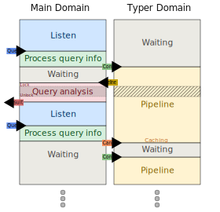

This report documents our experience portabilizing a multicore OCaml project to OxCaml. We describe the challenges we encountered, the solutions we found, and suggestions for improving the OxCaml developer experience.

# Introduction

## Background of the contributors

Two people worked on the portabilization: myself (Carine) and Timéo Arnouts. Neither of us had prior practical experience with OxCaml or with ownership-based type systems like Rust's.

- *Carine*: Senior engineer. Wrote the multicore part of `merlin-domains` as well as the original mock-up. Had read the three original blog posts about OxCaml roughly a year before the project and had some familiarity with the concepts from internal discussions, but no hands-on experience.

- *Timéo*: Junior engineer. No prior knowledge of OxCaml.

## About `merlin-domains`

[`merlin-domains`](https://github.com/ocaml/merlin/tree/merlin-domains) is an experimental branch of merlin that aims to leverage multicore programming to improve Merlin's performance. The general idea is to run a secondary domain in parallel to do most of the computation (typing) while the main domain mostly does query dispatching and execution of the query logic. This enables three performance-oriented features:

- **Early type return**: if permitted by the request, the secondary domain shares a partial typedtree with the main domain as soon as possible, so the main domain can perform the final analysis on it and answer the request without waiting for the full buffer to be typed. Meanwhile, the secondary domain goes back to finish typing the rest of the buffer. This optimization is especially useful for large buffers modified near the beginning.

- **Parallelization**: the two performance bottlenecks in Merlin are the typing and the final analysis. By running them in parallel thanks to early type return, we can reduce the overall latency of a request. This is difficult because both steps mutate shared state, creating data races. In the original OCaml version, some work is still needed to analyze the data races and find finer-grained solutions to avoid them.

- **Cancellation mechanism**: once the early type return is achieved, the main domain is back to listening for new requests while the secondary domain may still be typing the end of the buffer. If a new request arrives, the main domain can send a cancellation message to the secondary domain to stop the current work and start processing the new request.

  

These features create the concurrency patterns that OxCaml's mode system is designed to make safe: shared mutable state, cross-domain communication, and concurrent access to the same data.

## Reasons for portabilizing `merlin-domains` to OxCaml

- **Tractable multicore design:** `merlin` is a large, real-world project, but its multicore design is relatively simple: only two domains, no scheduler, and a straightforward message-passing data structure. It also features shared mutable state and data races, which OxCaml statically prevents: the portabilization must address them explicitly, exercising a key part of OxCaml's safety model.

- **Availability of a mock-up:** to experiment with different multicore designs, we wrote a [mock-up of the project](https://github.com/tarides/merlin_mockup). Since we were not very familiar with OxCaml when we started, the mock-up also served as a fallback in case we could not portabilize the real project, which ended up being the case. The mock-up was gradually extended to incorporate patterns from the real project that we identified as potential blockers for portabilization.

- **Concrete challenges representative of other projects**: when portabilizing a project to OxCaml, some code may need to remain in plain OCaml: whether from external libraries, vendored dependencies, or parts of the codebase that are not worth portabilizing. This OCaml code still needs to be interfaced with OxCaml. In `merlin-domains`, vendored code from the OCaml typer that contains mutable values is a concrete instance of this challenge (see [Integrating vendored code](#integrating-vendored-code)).


# The successes

Even though we did not portabilize `merlin-domains` itself, we consider the project a success on several fronts.

## Learning OxCaml

Starting from no hands-on experience, we learned enough of OxCaml to portabilize a non-trivial concurrent codebase. This included understanding modes, the capsule API, the concurrency libraries, and their interactions. The learning curve was steep (see [Learning OxCaml](#learning-oxcaml)), but the existing documentation and help from the JS team made it possible.

## Portabilizing the mock-up

We successfully portabilized the mock-up, which reproduces the key concurrency patterns of `merlin-domains`: two-domain architecture, message-passing, shared mutable state, partial results, and cancellation. The portabilized version compiles under OxCaml with DRF guarantees enforced at compile time, including for the vendored code, which we interfaced without modifying (see [Integrating vendored code](#integrating-vendored-code)).

## A better concurrent design for merlin-domains

Working with OxCaml's mode system pushed us to rethink the concurrent design of `merlin-domains`. The original design dedicates a secondary domain to typing, running a persistent loop that receives requests through a blocking message-passing structure and processes them one at a time. Exploring the available concurrency primitives made us realize that a fork-join model would give better control over what is shared between the two domains and what level of synchronization is needed at each step. We have not fully implemented this design yet, but we believe it would be easier to reason about and to portabilize than the original one. This improvement would also benefit the plain OCaml version of `merlin-domains`.

## Concrete suggestions for editor support

The portabilization experience led us to identify specific editor features that would help OxCaml developers (see [Helping the user through editor support](#helping-the-user-through-editor-support)). These suggestions come directly from the pain points we encountered and are grounded in concrete examples.

# The challenges

Portabilizing `merlin-domains` to OxCaml was a challenging experience, especially since it also includes learning OxCaml from scratch. Below, we describe the main challenges we encountered. As noted before, we focused our effort on leveraging OxCaml's DRF guarantee to make the parallelization work, and we did not take advantage of the other features of OxCaml (e.g. locality axis and unboxed types), which is why we don't mention challenges specifically related to these features below.

When evaluating the feasibility of the project, we identified the following expected challenges:

- learning OxCaml,
- which concurrency model to use,
- how to guarantee DRF without changing the vendored OCaml typer code?

We also encountered some non-expected challenges:

- sharing mutable state safely in OxCaml requires understanding most mode axes, modalities, and kinds, not just portability and contention as we initially expected.
- error messages: understanding the interaction between type errors and mode errors.

The two main challenges ended up being learning OxCaml and dealing with the vendored code.

## Learning OxCaml

### Context
We had no prior practical experience with OxCaml, and we had to learn it from scratch while portabilizing `merlin-domains`. This was a significant challenge, as OxCaml has a steep learning curve. 

### Challenge
We encountered two main challenges as newcomers to OxCaml trying to portabilize multicore code: understanding modes, and navigating the capsule API.

The first challenge is related to the diversity of modes. Each mode axis has its own logic, and there are many of them. This makes it difficult to develop a good intuition for when and how to use them. In practice, learning OxCaml translated for us into much trial and error, or going back and forth between the code and the [documentation](https://oxcaml.org/documentation/modes/intro/) to understand why a given mode is inferred and how to satisfy its constraint. It took us quite some time to even start portabilizing the code.

The second challenge was navigating the capsule API, which was the more significant challenge of the two, for several reasons:

- **Size.** The API is very long, making it hard to know which part to focus on when starting out.

- **Fragmentation.** The API is exposed through many libraries: [`capsule0`](https://github.com/janestreet/capsule0), [`capsule`](https://github.com/janestreet/capsule), [`await`](https://github.com/janestreet/await), `portable`, `core`. Each provides a different subset or wrapping of the same underlying types. Although they are mostly compatible, they do not expose the same functions, which makes it hard to know where to look for what one needs, especially combined with the size of these APIs. There are also some incompatibilities: for example, the following does not compile:

```ocaml
open Await

let read () =
  (* Create a capsule and a mutex using the blocking_sync API
   from the [capsule] library *)
  let (Capsule.Expert.Key.P key) = Capsule.Expert.create () in
  let blocking_mutex = Capsule.Blocking_sync.Mutex.create key in
  let data : (int ref, _) Capsule.Data.t =
    Capsule.Data.create (fun () -> ref 0)
  in
  (* Try to use it with Await.Mutex.with_access. It won't compile
   because Capsule.Blocking_sync.Mutex.t is not Await.Mutex.t *)
  let await = Await_blocking.await Terminator.never in
  Mutex.with_access await blocking_mutex ~f:(fun access ->
      !(Capsule.Data.unwrap ~access data))
```

- **Mode prerequisites.** Using capsules effectively requires understanding almost all mode axes: portability and contention for DRF, but also contention for access, locality for password, linearity and uniqueness for key usage. Kinds and modalities are also needed to understand mode crossing and make everything work. Learning just the portability and contention axes is not enough.

- **Lack of guided material.** The API is well documented in its `.mli` files, but reference documentation alone is not enough to build an understanding for when to use each way of opening a capsule (access, password, key). 

- **Verbosity.** Using the API requires a lot of boilerplate code, which tends to hide the core logic and make it harder to understand what is going on, especially for concurrent algorithms. Here is an example of how the API can make simple logic look more complex. This code is mostly extracted from the message-passing data structure we implemented for `merlin-domains`:

In OCaml: 
```ocaml
type 'a t = 
{ mutex : Mutex.t; 
  cond : Condition.t; 
  mutable msg : msg }

let send_and_wait t new_msg =
  Mutex.protect t.mutex (fun () ->
    t.msg <- new_msg;
    Condition.signal t.cond;
    while t.msg == new_msg do
      Condition.wait t.cond t.mutex
    done) 
```

In OxCaml:
```ocaml
module Lock = Capsule.Mutex.Create ()
type k = Lock.k

type 'a t : value mod contended portable = {
  mutex : k Mutex.t;
  cond : k Mutex.Condition.t;
  msg : (msg ref, k) Capsule.Data.t;
}

let send_and_wait t new_msg =
  let await = Await_blocking.await Terminator.never in
  Mutex.with_key await t.mutex ~f:(fun key ->
      let #((), key) =
        Capsule.Expert.Key.access key ~f:(fun access ->
            let msg = Capsule.Data.unwrap ~access t.msg in
            msg := new_msg)
      in
      Mutex.Condition.signal t.cond;
      let key = Mutex.Condition.wait await t.cond ~lock:t.mutex key in
      let rec loop key =
        let #(msg, key) =
          Capsule.Expert.Key.access key ~f:(fun access ->
              { Modes.Aliased.aliased = !(Capsule.Data.unwrap ~access t.msg) })
        in
        if msg.aliased == new_msg then
          let key = Mutex.Condition.wait await t.cond ~lock:t.mutex key in
          loop key
        else #((), key)
      in
      loop key [@nontail])
```

The core logic is the same in both versions (set the message, signal, wait until cleared), but in OxCaml it is interleaved with capsule unwrapping, key threading, and mode annotations, which makes it harder to follow at a glance.

### Approach
To learn OxCaml, the [oxcaml.org tutorials](https://oxcaml.org/documentation/tutorials/01-intro-to-parallelism-part-1/) and discussions with the JS team (special thanks to Liam and Aspen) were essential. For the capsule API specifically, we relied mostly on these discussions and on trial and error as no dedicated tutorial exists.

### Take-away
The learning curve could be made less steep with more guided material for the capsule API and better editor support for modes. We discuss concrete suggestions in the [editor support](#helping-the-user-through-editor-support) and [documentation](#making-the-learning-curve-less-steep) sections below.


## Finding the right concurrency primitive

### Context
`merlin-domains` uses a two-domain architecture with a message-passing coordination mechanism: the main domain handles request dispatching while a dedicated secondary domain performs the bulk of the computation (typing and the rest of the merlin pipeline). The two domains communicate through a shared synchronization structure using a blocking send/acknowledge protocol.

Here is a simplified version of the main function, in OCaml, that illustrates the interaction between the main domain and the secondary domain (typer) in `merlin-domains`:
```ocaml
let main () =
  (* Hermes is a data structure used to share data in between domains *)
  let hermes = Hermes.create (fun () -> None) in

  let typer =
    Domain.spawn (fun () ->
        let rec loop () =
          match Hermes.recv_clear hermes with
          | Config config ->
              (* some computation *)
              process config hermes;
              loop ()
          | Msg `Closing -> ()
        in
        loop ())
  in

  (try
     Server.listen ~handle:(fun req ->
         match req with
         | Server.Close -> raise Closing
         | Server.Config config ->
             (* Send work to the typer domain *)
             Hermes.send_and_wait hermes (Config config);
             (* Does more stuff and answer the request *)
             let r = run config hermes in
             answer r)
   with _ -> ());

  Hermes.send_and_wait hermes (Msg `Closing);
  Domain.join typer
```

### Challenge
We initially planned to use `Parallel.fork_join2` and rework our design to fit its fork/join model. However, `Parallel` provides *parallelism*, not *concurrency*: it is always a valid schedule to run one task to completion before starting the other. Our message-passing data structure requires *concurrency*: one task blocks on a condition variable until the other signals it. With `Parallel`, this leads to a deadlock.

Extract of the message-passing data structure written in OCaml:
```ocaml
type 'a t = { mutex : Mutex.t; cond : Condition.t; mutable msg : 'a option }

let send_and_wait t msg =
  Mutex.protect t.mutex (fun () ->
    let new_v = Some msg in
    t.msg <- new_v;
    Condition.signal t.cond;
    while t.msg == new_v do
      Condition.wait t.cond t.mutex
    done)
```
`send_and_wait` blocks until the other task calls `Condition.signal`. If the scheduler runs the first task to completion before starting the second, the signal never arrives.

`Concurrent` (which guarantees that runnable tasks make progress within finite time) would fit our needs, but at the time it did not provide additional value over `Multicore` for our use case.

### Approach
The best match we found for our use case is the `Multicore` library, which spawns actual domains and thus provides the concurrency guarantee we need: both tasks run independently and can make progress regardless of whether the other is blocked. The resulting code is very similar to the original `Domain.spawn` version in OCaml, except it provides the right modes to ensure DRF.

### Take-away

- There is very little documentation about which scheduling library to use for what. Only `Parallel` is covered in the oxcaml.org documentation; `Concurrent` and `Multicore` are not mentioned. Guidance on when to use each would help users avoid the kind of deadlock we encountered.

- Using a fork-join design would have helped us refine: (1) when concurrency (rather than parallelism) is needed, and (2) what must be shared between the two tasks at each fork.  

## Dealing with top level mutable state 

`merlin` uses a lot of top-level mutable state, both in its own code and in the vendored OCaml typer. In OxCaml, top-level mutable values can't be shared between domains. For merlin's own code, which we can modify, the fix is straightforward: wrap the mutable state in `Capsule.Data.t` (or in an `Atomic.t` if the operations performed on the value are translatable to atomic operations).

```ocaml
(* Before: nonportable, can't be shared *)
let res = ref []

(* After: portable, accessible under the mutex *)
let res : (typedtree, 'k) Capsule.Data.t =
  Capsule.Data.create (fun () -> ref [])
```

For the vendored code, which we should not modify, the problem is more complex and is addressed in the next section.

## Integrating vendored code

### Context

Dealing with vendored code was one of the main reasons we portabilized the mock-up rather than the real project: we needed a simpler codebase to explore possible approaches.

`merlin` vendors a large portion of the OCaml compiler. It is written in plain OCaml, was designed for a single-threaded world, and is full of mutable state: roughly 40+ module-level refs and mutable record fields. This vendored code should not be deeply rewritten in OxCaml: it is rebased onto each new OCaml release, and any modification would have to be redone at every rebase. Here we choose the extreme option of not altering the code at all. A similar situation would arise with any external library that is not portabilized to OxCaml: we want to use it as is, without modifying it, but we still need to interface with it from OxCaml code.

In `merlin-domains`, both domains call into vendored code: the worker domain runs the typer, and the main domain runs analysis code. During the partial result scenario, both execute concurrently, creating data races on the vendored mutable state.

### Challenge

The vendored code is plain OCaml: its functions are `nonportable` and can't be called from a `portable` context (e.g. inside a `fork_join` or a capsule callback). The most straightforward approach is to wrap them with `Obj.magic_portable`:

```ocaml
module Vendored : sig
  type env
  val create : unit -> env
  val add_entry : env -> string -> unit
  val compute : int -> bool
end = struct
  type env = { entries : string list ref }
  let global_counter = ref 0

  let add_entry env s =
    env.entries := s :: !(env.entries);
    incr global_counter
  
  let compute n =
    global_counter := !global_counter + n;
    !global_counter mod 2 = 0
end
```
```ocaml
(* Naive wrapper: makes vendored functions portable, but provides
   no protection against data races. *)
module Wrapper_naive : sig @@ portable
  val add_entry : Vendored.env -> string -> unit
  val compute : int -> bool
end = struct
  let add_entry = Obj.magic_portable @@ Vendored.add_entry
  let compute = Obj.magic_portable @@ Vendored.compute
end
```

This makes the functions callable from both domains, but nothing prevents two domains from calling them concurrently. Both `add_entry` and `compute` mutate hidden global state so calling any combination of these from two domains in parallel is a data race. The naive wrapper compiles, but it is no safer than plain OCaml.

We needed to find a way to leverage OxCaml's mode system to enforce mutual exclusion on vendored function calls at compile time, without being able to change the vendored code itself.

### Approach

Our approach is to require a branded `Capsule.Access.t` to call any wrapper function. We create a single mutex and tie the wrapper to its brand `k`. We also wrap the visible mutable state (`Vendored.env`) in a `Capsule.Data.t`, so that unwrapping it requires the same `Access.t`:

```ocaml
module Lock = Capsule.Mutex.Create ()
type k = Lock.k

module Wrapper : sig @@ portable
  type env : value mod contended portable = (Vendored.env, k) Capsule.Data.t

  val create : unit -> env
  val add_entry : access:k Capsule.Access.t -> env -> string -> unit
  val compute : access:k Capsule.Access.t -> int -> bool
end = struct
  type env : value mod contended portable = (Vendored.env, k) Capsule.Data.t

  let create_ = Obj.magic_portable @@ Vendored.create
  let create () : env = Capsule.Data.create create_
  let add_entry_ = Obj.magic_portable @@ Vendored.add_entry

  let add_entry ~(access : k Capsule.Access.t) env s =
    add_entry_ (Capsule.Data.unwrap ~access env) s

  let compute_ = Obj.magic_portable @@ Vendored.compute
  let compute ~(access : k Capsule.Access.t) n = compute_ n
end
```

The key idea: the only way to obtain a `k Capsule.Access.t` is through `Lock.mutex`, so callers are forced to hold the mutex before calling any wrapper function. Since `k` is abstract, no other mutex can produce a compatible `Access.t`. This gives a compile-time guarantee that all vendored code runs under mutual exclusion.

For `add_entry`, the `Access.t` serves a double purpose: it is needed both to unwrap `env` from its `Capsule.Data.t` and to authorize the call (which mutates hidden global state). Also wrapping `env` in a capsule is not strictly necessary for the mutex discipline, it makes it explicit in the signature that `env` is stateful.

For `compute`, which does not take an `env` argument, the `Access.t` only serves as an authorization token: it is not structurally needed, but requiring it ensures the caller holds the mutex. In both cases, the wrapper is the trust boundary: `Obj.magic_portable` casts are used inside, and the wrapper author must verify which vendored functions need to be called under the lock. Outside the wrapper, the compiler enforces the discipline: no `Access.t`, no call.

On the caller side, this looks like:

```ocaml
let await = Await_blocking.await Terminator.never in
Mutex.with_key await Lock.mutex ~f:(fun key ->
    Capsule.Expert.Key.access key ~f:(fun access ->
        Wrapper.add_entry ~access env "hello";
        let _ = Wrapper.compute ~access 42 in
        ()))
```

We use a single mutex for all vendored state. This does not mean a single big critical section: the caller controls when to acquire and release the lock, and concurrency comes from the gaps between acquisitions. We chose a single mutex because many vendored functions touch multiple pieces of state at once, making fine-grained locking impractical and deadlock-prone.

### Take-away

- **The branded `Access.t` pattern is a general approach** for interfacing OxCaml code with non-OxCaml dependencies: the compiler enforces the mutex discipline at the boundary, without modifying the dependency.

- **The guarantee is only as good as the wrapper**: a vendored function missing from the wrapper can be called without the mutex. The wrapper must be audited manually. `tsan` would also be very helpful here. 

- **The wrapper maintenance cost seems acceptable for merlin**: it only needs updating when the vendored API surface changes (new or modified function signatures), not for internal refactors.

- **Open question**: is wrapping visible state in `Capsule.Data.t` worth the added verbosity? The `Access.t` token already forces the mutex, so the structural protection it adds seems marginal.

- **OxCaml to OCaml side note**: As a side note, we wondered whether it would be possible to write the concurrent parts of a project in OxCaml for the DRF guarantees, then extract plain OCaml from it. This would probably require some form of code extraction, but could be useful for projects that can't fully switch to OxCaml.

## Interaction between type errors and mode errors

We document here two non-obvious behaviors with mode errors that we encountered. We propose no solution; these are observations that may be worth investigating. Both come from the fact that mode crossing depends on the type of a value, and the type may not be fully resolved when the mode is checked.

### Mode errors fixed with a type annotation

```ocaml
type msg = Empty | Msg of int option

(* Without annotation: the mode of x is checked at line 6 before
   the match on line 8 constrains x to [msg]. The compiler doesn't
   know x is an immutable variant that crosses contention. *)
let foo par x =
  let #(v, ()) =
    Parallel_kernel.fork_join2 par (fun _par -> x) (fun _par -> ())
    (*                                          ^       *)
    (*  Error: x is "shared" but expected "uncontended" *)
  in
  match v with Empty -> Empty | Msg opt -> Msg (Option.map (( + ) 1) opt)

(* With annotation: [msg] is known at the point where modes are checked.
   [msg] is immutable data, so it crosses contention. It compiles. *)
let foo' par (x : msg) =
  let #(v, ()) =
    Parallel_kernel.fork_join2 par (fun _par -> x) (fun _par -> ())
  in
  match v with Empty -> Empty | Msg opt -> Msg (Option.map (( + ) 1) opt)
```

The mode error disappears with a type annotation. This is confusing because a mode error naturally leads one to look for a mode fix rather than a type fix.

### Mode error that masks a type error

The following is a simple example where fixing a type error also fixes a mode error. The same pattern exists in plain OCaml (one type error can mask another), but mode errors push developers toward mode fixes, which may not be the root cause. 

```ocaml
let make () = exclave_ stack_ ("hello", 42)

(* Mode error: p is local, can't be returned. *)
let f () =
  let p = make () in
  p

(* Type error: f () returns (string * int), not int.
   But this error is hidden because f doesn't compile. *)
let g () =
  let x : int = f () in
  x + 1
```

The compiler reports the mode error on `p` in `f` and never shows the type error in `g`. Returning `snd p` instead of `p` fixes both: `int` crosses locality, and the type matches `g`'s expectation.

`merlin` already provides a good partial answer to this problem by showing the type error in `g` as a secondary error, but it is still easy to miss the dependency between both errors (obviously not in this oversimplified example).


# Suggestions for improving the developer experience

Based on our experience, we suggest two directions for making OxCaml more accessible:

- **Editor support**: features to help developers inspect modes, navigate mode-expanded APIs, and understand mode inference through their own code.
- **Guided learning**: a pedagogical tool to help developers build intuition about modes incrementally, through exercises and repetition.

## Helping the user through editor support

The same way `rust-analyzer` provides indicators and hints to help deal with lifetime and ownership, we think that editor support could be extremely helpful with OxCaml. It could help developers understand what has been inferred, navigate APIs made larger by mode variants, and develop the intuition needed to work with modes.

Based on our experience portabilizing `merlin-domains`, we suggest four directions for editor features that we think would be especially helpful:

- **Inspecting modes**: seeing what modes a value has, and which ones matter for its type.
- **Mode-aware completion**: filtering completion and search results by mode compatibility, to help navigate APIs that expose many variants of the same function for different modes.
- **Error message readability**: highlighting all code locations referenced in a mode error, not just the error site.
- **Understanding mode inference**: tracing why a given mode was inferred, to help diagnose errors and develop intuition.

These are suggestions: we have not studied their feasibility. The first three seem reasonable to implement; the last one would definitely require more research.

### Inspecting modes

From what we know, this is a feature that may have already been implemented internally at Jane Street but has not been released yet. In case it hasn't, here is a short description of what it could look like and why it would be useful.

Like type inspection, mode inspection is a straightforward but essential feature. For example:

```ocaml
type state = { mutable count : int }

let process (s : state) par =
  let read _par = s.count in
  let inc _par = s.count <- s.count + 1 in

  (* [read] compiles in fork_join2 but not [inc].

     Hovering over [read] would show:
       ('a -> int) @ shareable
     Hovering over [inc] would show:
       ('a -> unit) (all modes are default)
     A specific command could show all the modes:
       ('a -> unit) @ global aliased many nonportable uncontended

    making it clear [read] is compatible with fork_join2 while [inc] is not. *)

  let #(_, ()) = Parallel_kernel.fork_join2 par read inc in
  () 
```

Concretely:

- Modes should be available via hovering or a command that adds annotations, similar to type-enclosing increase-verbosity feature.
- A growing/shrinking selection would help manage the information: show only non-default modes first, then all pertinent modes (i.e. the modes NOT crossed by its kind), then all modes.


### Mode-aware completion

Inside a mode-constrained context, many functions are not usable, whether they come from local definitions or external libraries. Today, completion shows them all, and the developer discovers the incompatibility only after selecting one.

With local definitions:
```ocaml
module T : sig
  val foo_p : unit -> int option @@ portable
  val foo_np : unit -> unit
end = struct
  let a = ref (Some 42)
  let foo_np () = a := Option.map (( + ) 1) !a
  let foo_p () = Some 12
end

let foo par = Multicore.spawn T.__ () |> ignore
(*                              ^^
   Completion shows both [foo_p] and [foo_np], but only
   [foo_p] is compatible with [spawn]’s portable requirement. *)
```

With external libraries:
```ocaml
open! Core

let foo () =
  let l = stack_ [ 1; 2; 3 ] in
  List.__ l ~f:(fun _ -> ()) [@nontail]
  (*   ^^
     Completion shows [iter], [map], [filter], ...
     but with a local list, the global variants won't work. *)
```

Mode-aware completion would work the same way type-aware completion already does: by ranking results based on compatibility with the current context. In the `List` example, `List.iter__local` should be ranked higher than `List.iter` when the argument is local. In the `Multicore.spawn` example, `foo_p` should rank higher than `foo_np`. It could also provide a short hint about incompatible candidates (e.g. “`List.iter` requires a global argument, but `l` is local”).

### Using the editor to improve error message readability

Mode error messages often reference several locations in the code (the error site, the capture site, the constraint source, etc.). Today, the editor only underlines the error site. A simple improvement would be to expose all referenced locations through LSP diagnostics and highlight them in the editor. For example, the following code:

```ocaml
let state = ref 0

let f par =
  let g x = state := x in
  let h () = g 42 in
  Parallel_kernel.fork_join2 par
    (fun _par -> h ())
    (fun _par -> ())
```

produces this error:
```shell
The value "h" is "nonportable"
  because it closes over the value "g" at line 4, characters 13-14
    which is "nonportable"
    because it contains a usage (of the value "state" at line 4, characters 12-17)
      which is expected to be "uncontended".
  However, the value "h" highlighted is expected to be "shareable"
    because it is used inside the function at line 7, characters 4-22
      which is expected to be "shareable".
```

The error message already contains all four locations (`state`, `g`, `h`, the closure). Highlighting them in the editor would make the chain immediately visible without having to read the full text.

This feature would also be useful for plain OCaml type errors, which similarly reference multiple locations. It could also be a good first step towards the more ambitious "understanding mode inference" feature described below.

### Understanding mode inference

When a mode error occurs, the compiler reports the conflict at the use site and while the error messages are usually good, they do not always trace back to the root cause. This can be confusing when the value’s mode was determined far from where it is used. For example:

```ocaml
open! Await
module Lock = Capsule.Mutex.Create ()

let data : (int list ref, Lock.k) Capsule.Data.t =
  Capsule.Data.create (fun () -> ref [])

let make_processor () =
  let cache = ref [] in
  let f x =
    cache := x :: !cache;
    List.length !cache
  in
  f
```
```ocaml
let example () =
  let foo = make_processor () in
  (* ... 50 lines of code ... *)
  let await = Await_blocking.await Terminator.never in
  Mutex.with_access await Lock.mutex ~f:(fun access ->
      let data = Capsule.Data.unwrap ~access data in
      let _ = foo !data in
      ())
```

The compiler rejects this with `”foo” is “nonportable” but expected to be “portable”` on `foo` at line 21. But it does not explain *why* `foo` is nonportable. The root cause is that `make_processor` captures a mutable `cache` ref (line 8), which makes the returned closure nonportable. If `make_processor` is defined in a different module or far away, the developer has no easy way to find this.

An editor feature that, on command, displays the full inference chain for a selected value would help. For example, selecting `foo` at line 21 could show:

```shell
foo : int list -> int
  line 16: bound @ nonportable
    because: returned from [make_processor]
    because: captures [cache] (mutable ref, line 8)
  line 21: required @ portable
    because: used inside Mutex.with_access ~f (which requires @ portable)
```

This is similar to what the compiler already computes for some errors, but exposed on demand for any value, including in code that compiles successfully. It could be displayed in a side panel or using code-lenses.

Here is another example, on the linearity axis: 
```ocaml
let consume (x @ unique) = ignore x

let example (x @ unique) =
  let f () = consume x in
  let g () = f () in
  g ();
  g ()
```

The trace could show: 
```shell
g : unit -> unit
  line 5: bound @ once
    because: captures [f] (line 4) which is @ once
    because: [f] captures [x] which is @ unique
  line 7: error: once, already used at line 6
```
Whereas the compiler only reports that `g` is `once` and was already used at line 6, without explaining the `g` → `f` → `x @ unique` chain.

Such traces could be added to the error message itself, but they are already pretty long. An "on-demand" feature seems more appropriate to avoid overwhelming users who just want to see the error. It would also be useful for values that compile successfully, to understand why a given mode was inferred and develop intuition about modes.

We did not investigate the feasibility of this feature, but it could be a powerful way to help developers build intuition about modes. We propose a complementary approach in the next section.

## Making the learning curve less steep

The learning curve of OxCaml could obviously be smoothed with more examples, tutorials, and documentation. Rather than elaborating on that, we want to sketch a complementary idea: an exercise-based learning tool that would help developers build intuition about modes through guided trial and error. Such a tool could take many forms: annotated `.ml` files, a CLI tool like [rustlings](https://rustlings.rust-lang.org/), a web app, or a VS Code plugin leveraging code lenses etc..

The key difference with documentation is that each exercise would provide more context than a compiler error: not just "this is local but expected global", but *why* it is local, *what local means in terms of memory*, and *what the options are to fix it*. Exercises would be organized in progressive sequences, one concept at a time, covering each mode axis and then combinations. Here is a rough sample for the locality axis:

```ocaml
(* 1. [@ global] is the default. A global value can escape. *)
let ex1 () =
  let a @ global = Some "foo" in
  a
(* Compiles. *)

(* 2. [@ local] asserts that [a] is local: it can no longer escape. *)
let ex2 () =
  let a @ local = Some "foo" in
  a
(* Error: a is local but escapes its scope. *)

(* 3. Without annotation, the mode is inferred. [a] escapes, so it
      must be global. *)
let ex3 () =
  let a = Some "foo" in
  a
(* Compiles. Same as ex1: the annotation was redundant. *)

(* 4. A local value can be used locally, just not returned. *)
let ex4 () =
  let a @ local = Some "foo" in
  match a with Some _ -> true | None -> false
(* Compiles. [a] doesn't escape. *)

(* 5. Locality is deep: [x] extracted from a local [a] is local too. *)
let ex5 () =
  let a @ local = Some "foo" in
  match a with Some x -> x | None -> ""
(* Error: x is local (from a), can't escape. *)

(* 6. Same pattern, but [x : int]. Integers are immediate and cross
      locality. *)
let ex6 () =
  let a @ local = Some 42 in
  match a with Some x -> x | None -> 0
(* Compiles! [int] is never heap-allocated, so locality doesn't
   apply. *)
```

In a more interactive format, exercises could show code with blanks and let the learner pick from predefined choices. Each attempt would show the compiler output alongside an explanation. For example:

```ocaml
  let foo () =
    let a [1]_________ = Some "foo" in
    [2]_______________
 
(* [1] [ @ global ]  [ @ local ]
   [2] [ a ]  [ (a : _ @ global) ] *)
```

|   |   |   |   |
|---|---|---|---|
| 1 | `@ global` | `@ local` | `@ local` |
| 2 | `a` | `a` | `(a : _ @ global)` |
| | | | |
| **Result** | Compiles: `a` is global, can escape | Error: local value escapes its scope | Error: local value can't be coerced to global |

The value of such a tool is both in the ability to quickly and easily explore many combinations and in repetition: by hitting the same errors in different contexts, the learner develops reflexes on which bugs (and thus fixes) match which error message. E.g., seeing "local but expected global" and knowing immediately to look for an escaping value or a missing [@nontail] annotation.

# Conclusion

OxCaml's DRF guarantees are powerful and, once understood, genuinely help write safer concurrent code. The learning curve is steep but manageable with the existing documentation and support. The main remaining friction points (navigating the capsule API, understanding mode inference, and interfacing with non-OxCaml code) are addressable through better tooling, and we hope the suggestions in this report contribute to that effort.

# Links
[Merlin-domains branch](https://github.com/ocaml/merlin/tree/merlin-domains)

[Merlin-domains mockup](https://github.com/tarides/merlin_mockup)

[Portabilized merlin-domains mockup](https://github.com/tarides/merlin_mockup/tree/oxcaml)

